```{r setup, include=FALSE}

knitr::opts_chunk$set(echo = TRUE, fig.align = "center")
```

class:  center, middle
# What is R-Ladies?

Worldwide organization that  promotes **gender diversity** in the R community. 

# How?

Meetups and mentorship in a friendly and safe environment. 


# For whom?
Underrepresented genders - including but not limited to cis/trans women, trans men, non-binary, genderqueer, agender


Reference: [About us - R-Ladies](https://rladies.org/about-us/)

---
class:   center, middle
# Mission 

As a diversity initiative, the mission of R-Ladies is to achieve proportionate representation by encouraging, inspiring, and empowering people of genders currently underrepresented in the R community.


Reference: [About us - R-Ladies](https://rladies.org/about-us/)


---
class:   center, middle
# How did R-Ladies begin?
```{r echo=FALSE, fig.align='center', out.width="40%"}

```
**[Gabriela de Queiroz](https://github.com/gdequeiroz)** founded R-Ladies on **October 1, 2012**. She wanted to give back to the community after going to several meetups and learning a lot for free.  The first meetup was placed in **San Francisco, California (United States)**. In the following years more R-Ladies chapters started around the globe. 

Reference: [About us - R-Ladies](https://rladies.org/about-us/history/)


---
class:center, middle

```{r echo=FALSE, out.width="100%"}
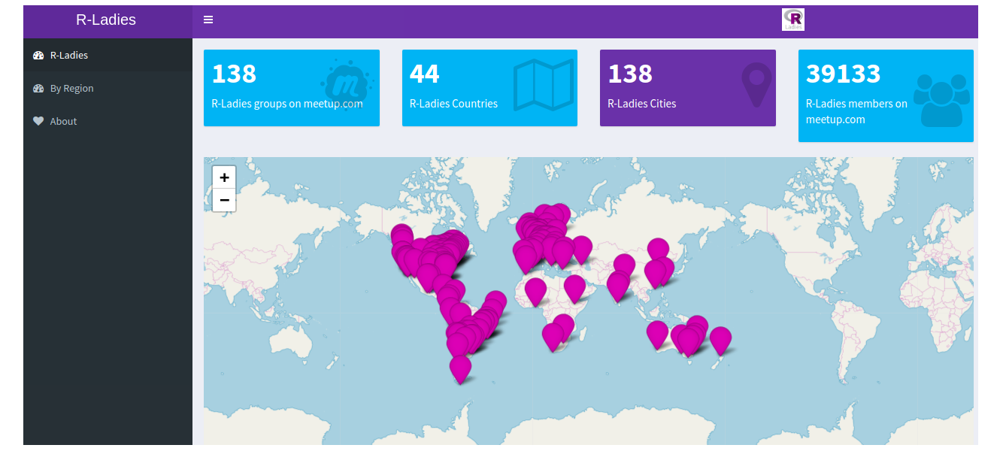
```


Reference: [R-Ladies Shiny App](https://gqueiroz.shinyapps.io/rshinylady/)  (26/01/2019)
---
class:   center, middle
# Code of conduct

R-Ladies is dedicated to providing a harassment-free experience for everyone. We do not tolerate harassment of participants in any form.


[R-Ladies Code of Conduct](https://rladies.org/code-of-conduct/)


---
class:  center, middle
# How to get involved

[Meetup](https://www.meetup.com/pt-BR/R-Ladies-Sao-Paulo)

Twitter: [@RLadiesGlobal](https://twitter.com/rladiesglobal)

Website: [https://rladies.org/](https://rladies.org/)

R-Ladies LATAM Blog (Latin America) - Comming soon!


[R-Ladies - How do get involved](https://rladies.org/about-us/help/)

---
class:   center, middle

# R-Ladies São Paulo


```{r echo=FALSE, fig.align='center'}
knitr::include_graphics("img/1meetupsp.jpeg")
```
**First R-Ladies São Paulo Meetup**


---

# Cronograma de hoje

- Data Science <br></br>
- Introdução ao ambiente R <br></br>
- O pacote Tidyverse <br></br>
- Desafios hands-on <br></br>
- Para aprender mais

---

# O que é Data Science?

**Data Science** ou **Ciência de Dados** é uma ciência interdisciplinar sobre o processamento de grandes conjuntos de dados usando métodos estatísticos para extrair insights sobre os dados brutos.

```{r echo=FALSE, fig.align='center', out.width="70%"}
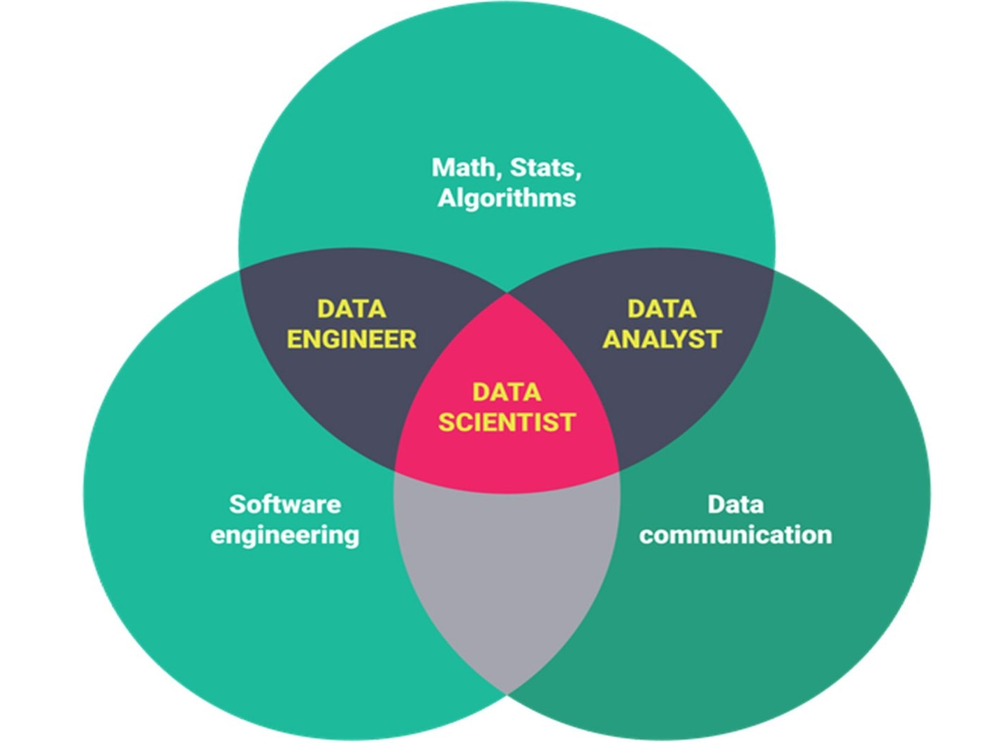
```

---

# Ciclo da Ciência de Dados
```{r echo=FALSE, fig.align='center', out.width="100%"}
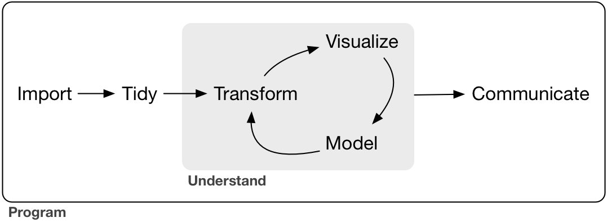
```


**Fonte:** [R For Data Science](https://r4ds.had.co.nz/introduction.html)

---
class: middle

# Ciência de Dados

```{r echo=FALSE, fig.align='center', out.width="100%"}
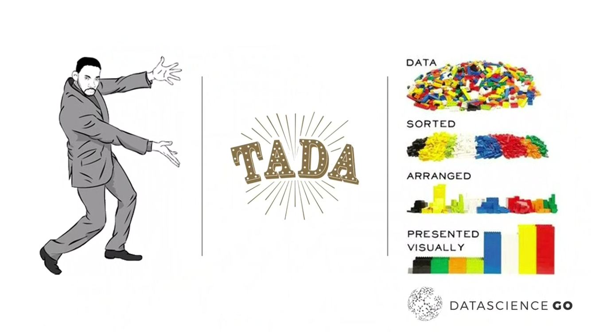
```

**Fonte:** slide do Randy Lao na Conferência Data Science Go 2018
---
# O que é o R?

> R is a free software environment for statistical computing and graphics. (https://www.r-project.org/)

> R é um ambiente de software livre para computação estatística e gráficos.


* O R é open-source;

* Muito usado por cientistas de dados, estatísticos e pesquisadores.


```{r echo=FALSE, out.width="40%"}
knitr::include_graphics("img/Rlogo.png")
```
---
# Por que usar o R?

- É uma linguagem de programação para análise de dados

- É open source 

- Possui uma comunidade ativa de desenvolvedores

- É flexível, permitindo desenvolver funções e pacotes para facilitar o trabalho 

- Está disponível em diferentes plataformas: Windows, Linux e Mac
---
## O que podemos fazer com o R?

* Análise de dados - Estatística, modelagem, etc.

* Visualização de dados

* Apresentações 

* Relatórios dinâmicos

* Escrever livros 

* Mineração de dados

* Muito mais ...
---

**Exemplo: Gráfico elaborado com R - Proposta Orçamentária PMSP 2019 - 10 maiores orçamentos** 

```{r echo=FALSE, out.width="90%"}
knitr::include_graphics("https://beatrizmilz.github.io/DadosExecucaoOrcamentariaPMSP/proposta2019_files/figure-html/unnamed-chunk-5-1.png") 
```
Fonte: [Explorando o orçamento da Prefeitura Municipal de São Paulo](https://beatrizmilz.github.io/DadosExecucaoOrcamentariaPMSP/proposta2019.html)


---

**Exemplo: Gráfico elaborado com R - Execução Orçamentária PMSP na função Gestão Ambiental** 

```{r echo=FALSE, out.width="90%"}
knitr::include_graphics("https://beatrizmilz.github.io/DadosExecucaoOrcamentariaPMSP/gestaoambiental_files/figure-html/unnamed-chunk-5-1.png") 
```
Fonte: [Explorando o orçamento da Prefeitura Municipal de São Paulo](https://beatrizmilz.github.io/DadosExecucaoOrcamentariaPMSP/gestaoambiental.html)


---

**Exemplo: Gráfico elaborado com R - Material Particulado 10 - Dados CETESB - RPollution;** 

```{r echo=FALSE, out.width="90%"}
knitr::include_graphics("https://www.rpollution.com/blog/pm-em-sp_files/figure-html/unnamed-chunk-6-1.png") 
```
Fonte: [Rpollution](https://www.rpollution.com/)

---

**Exemplo: Frequencia de Palavras - TESE Doutorado PROCAM/USP Ana Lucia Spinola;** 

```{r echo=FALSE, out.width="90%"}
knitr::include_graphics("img/ana-lu-freq.png") 
```
Fonte: [Ana Lu Spinola](https://analuspi.github.io/Text-Mining/)
---

**Exemplo: BIGRAM - TESE Doutorado PROCAM/USP Ana Lucia Spinola;** 

```{r echo=FALSE, out.width="90%"}
knitr::include_graphics("img/bigram-ana-lu.png") 
```
Fonte: [Ana Lu Spinola](https://analuspi.github.io/Text-Mining/)


---

class: center, middle
# R Básico

---

# Instalação R e R Studio

Escolha a versão para o seu sistema operacional:

- [Instalação do R](https://cloud.r-project.org) 

- [Instalação do R Studio](https://www.rstudio.com/products/rstudio/download/#download)

---

# RStudio

**RStudio** é o IDE da Linguagem R, ou seja, o ambiente que utilizamos para editar e executar os códigos em R. Tem quatro áreas, conforme a figura abaixo:

```{r echo=FALSE, out.width="90%"}
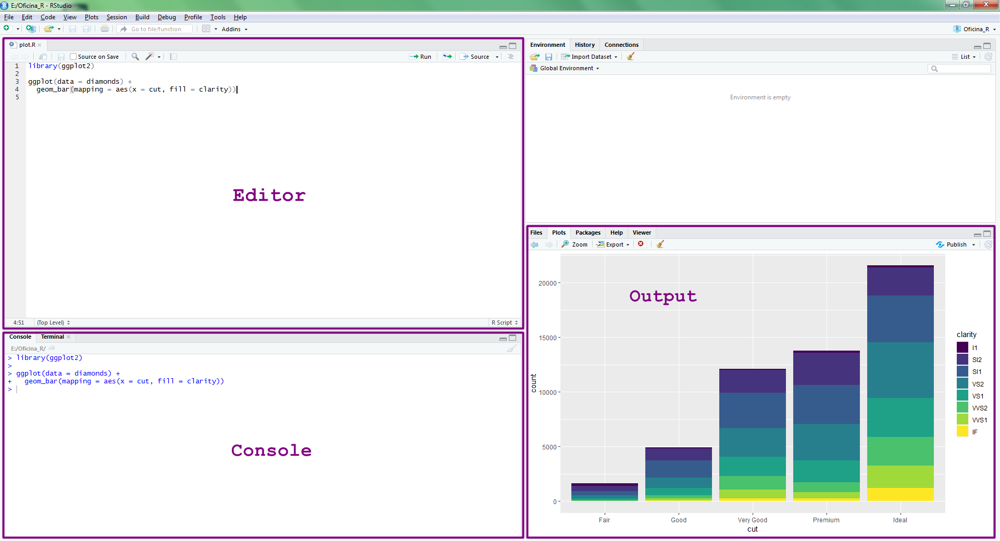
```

---
## Projetos

> "A good project layout will ultimately make your life easier: It will help ensure the integrity of your data; It makes it simpler to share your code with someone else (a lab-mate, collaborator, or supervisor); It allows you to easily upload your code with your manuscript submission; It makes it easier to pick the project back up after a break."
    

> "Um bom layout de projeto facilitará sua vida: ajudará a garantir a integridade de seus dados; facilita o compartilhamento de seu código com outra pessoa (colega de laboratório, colaborador ou orientador); ele permite que você facilmente faça o upload do seu código com a submissão do seu manuscrito; torna-se mais fácil recuperar o projeto depois de um intervalo. "

Fonte: [SW Carpentry](http://swcarpentry.github.io/r-novice-gapminder/02-project-intro/index.html)

---
## Boas práticas para organizar seu projeto


> 1. **Tratar dados como somente leitura: **esse é provavelmente o objetivo mais importante da configuração de um projeto. Os dados geralmente consomem tempo e/ou são caros para coletar. Trabalhar com eles interativamente (por exemplo, no Excel), onde eles podem ser modificados, significa que você nunca tem certeza de onde os dados vieram, ou como eles foram modificados desde a coleta. Portanto, é uma boa ideia tratar seus dados como “somente leitura”.

> 2. **Qualquer coisa gerada pelos seus scripts deve ser tratada como descartável: **todos devem poder ser criados novamente a partir dos seus scripts. Existem várias maneiras diferentes de gerenciar essa saída. Acho útil ter uma pasta de saída com subdiretórios diferentes para cada análise separada. Isso fica mais fácil depois, já que muitas das análises são exploratórias e não acabam sendo usadas no projeto final, e algumas análises são compartilhadas entre os projetos.


Fonte: [SW Carpentry](http://swcarpentry.github.io/r-novice-gapminder/02-project-intro/index.html)
---

## Criando um projeto

1. Clique na opção **“File”** do menu, e então em **“New Project”**.

1.  Clique em **“New Directory”**.

1.  Clique em **“New Project”**.

1.  Escreva o nome do diretório (pasta) onde deseja manter seu projeto, ex “my_project”.

1.  Clique no botão **“Create Project”**.


OBS: Crie um novo script para escrever seus códigos!
  **File -> New File -> RScript **

---
## RStudio
```{r echo=FALSE, out.width="100%"}
knitr::include_graphics("img/01-rstudio.png")
```
Fonte: [SW Carpentry](http://swcarpentry.github.io/r-novice-gapminder/01-rstudio-intro/index.html)
---
## RStudio
```{r echo=FALSE, out.width="100%"}
knitr::include_graphics("img/01-rstudio-script.png")
```
Fonte: [SW Carpentry](http://swcarpentry.github.io/r-novice-gapminder/01-rstudio-intro/index.html)


---
## RStudio
```{r echo=FALSE, out.width="90%"}
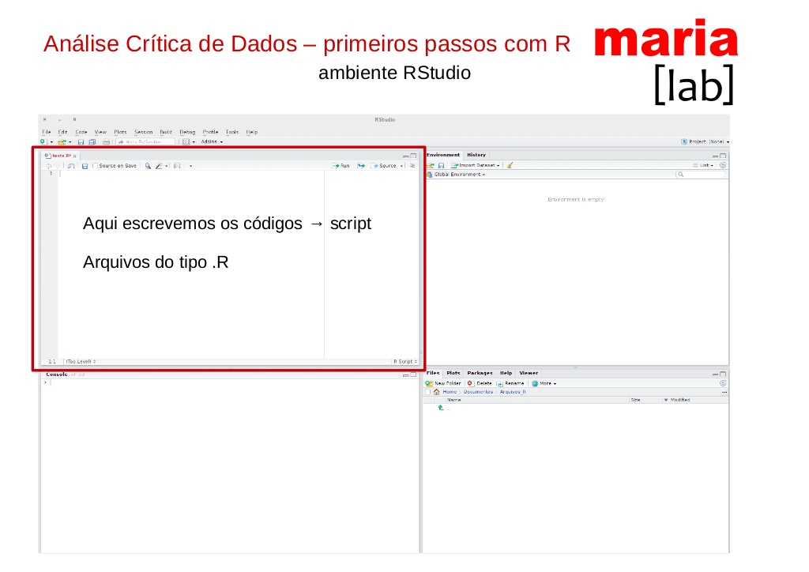
```
Fonte: [Haydee Svab](https://www.slideshare.net/mobile/haydeesvab/anlise-crtica-de-dados-primeiros-passos-com-r)

---
## RStudio
```{r echo=FALSE, out.width="90%"}
knitr::include_graphics("img/haydee2.jpg")
```
Fonte: [Haydee Svab](https://www.slideshare.net/mobile/haydeesvab/anlise-crtica-de-dados-primeiros-passos-com-r)

---
## RStudio
```{r echo=FALSE, out.width="90%"}
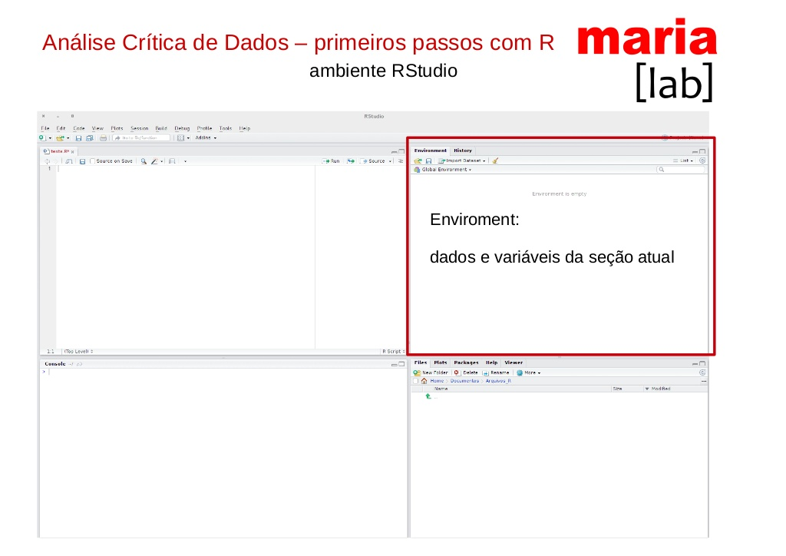
```
Fonte: [Haydee Svab](https://www.slideshare.net/mobile/haydeesvab/anlise-crtica-de-dados-primeiros-passos-com-r)

---
## RStudio
```{r echo=FALSE, out.width="90%"}
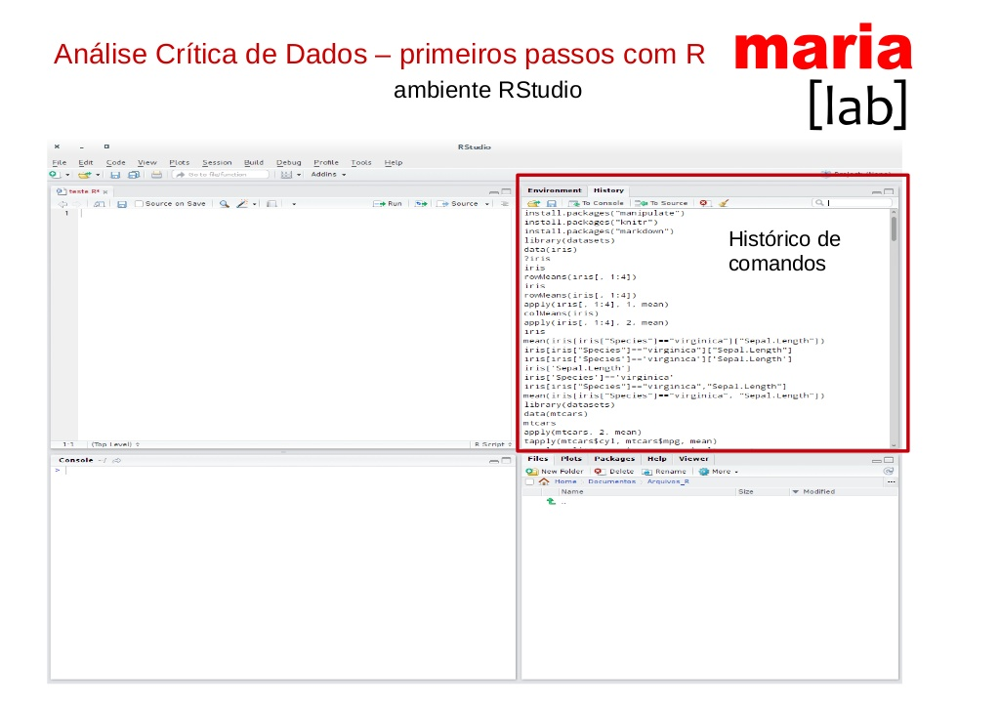
```
Fonte: [Haydee Svab](https://www.slideshare.net/mobile/haydeesvab/anlise-crtica-de-dados-primeiros-passos-com-r)

---
## RStudio
```{r echo=FALSE, out.width="90%"}
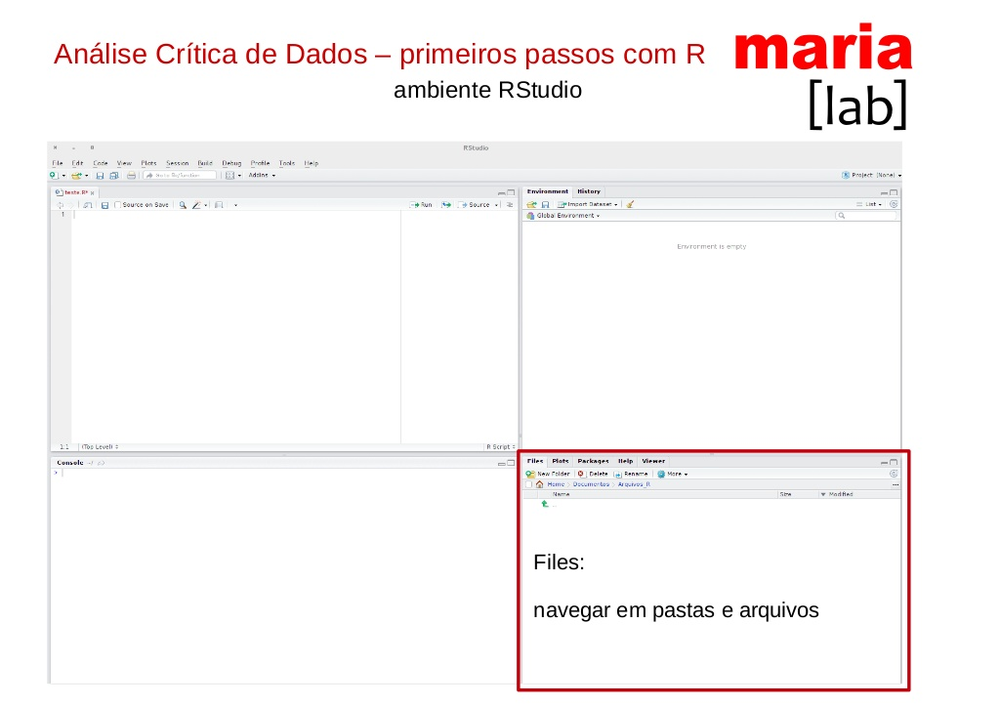
```
Fonte: [Haydee Svab](https://www.slideshare.net/mobile/haydeesvab/anlise-crtica-de-dados-primeiros-passos-com-r)

---
## RStudio
```{r echo=FALSE, out.width="90%"}
knitr::include_graphics("img/haydee6.jpg")
```
Fonte: [Haydee Svab](https://www.slideshare.net/mobile/haydeesvab/anlise-crtica-de-dados-primeiros-passos-com-r)

---
## RStudio
```{r echo=FALSE, out.width="90%"}
knitr::include_graphics("img/haydee7.jpg")
```
Fonte: [Haydee Svab](https://www.slideshare.net/mobile/haydeesvab/anlise-crtica-de-dados-primeiros-passos-com-r)

---
## RStudio
```{r echo=FALSE, out.width="90%"}
knitr::include_graphics("img/haydee8.jpg")
```
Fonte: [Haydee Svab](https://www.slideshare.net/mobile/haydeesvab/anlise-crtica-de-dados-primeiros-passos-com-r)


---

# Help!

- Pedir ajuda: **help**(nome_da_funcao) ou **?**nome_da_funcao.

```{r, eval=FALSE}
help(sum)
?sum
```

- Se a dúvida permanecer, procure no Stack OverFlow, Google.
  - E se ainda tiver dúvidas, pergunte para a comunidade (há grupos no Telegram e outras redes sociais).

---

### Pacotes no R

**Pacotes** são coleções de funções, dados e documentação que estendem as capacidades do R básico.

Eles precisam ser instalados e carregados.

<center></center>

---

### Instalação de Pacotes:

- Via CRAN: install.packages("nome-do-pacote").

```{r, eval=FALSE}
install.packages("tidyverse")
```

- Via Github: devtools::install_github("nome-do-repo/nome-do-pacote").

```{r, eval=FALSE}
devtools::install_github("tidyverse/dplyr")
```


### Carregar pacotes:

- library(nome-do-pacote)

```{r, eval=TRUE, message=FALSE}
library(tidyverse)
```

---

### Dicas sobre Pacotes

1. Você só precisa instalar o pacote uma vez, mas precisa carregá-lo sempre que começar uma nova sessão;

2. Para instalar o pacote use as aspas;  

3. Para carregar o pacote, **não** utilize as aspas.
---

# Pacotes - CRAN Task View

- [CRAN Task View](https://cran.r-project.org/web/views/)

- [CRAN Task View: Analysis of Ecological and Environmental Data](https://cran.r-project.org/web/views/Environmetrics.html) - Ex: Hydrology and Oceanography, Climatology, etc.

- [CRAN Task View: Analysis of Spatial Data](https://cran.r-project.org/web/views/Spatial.html) - Ex: Ecological analysis, Geostatistics, etc.


---

# Atalhos importantes

Os atalhos facilitam. Veja os principais:<br></br>

- CTRL + ENTER: roda a linha selecionada no script.<br></br>
- ALT + **-**: (<-) sinal de atribuição.<br></br>
- CTRL + SHIFT + M: (%>%) operador pipe.<br></br>

---

### R como calculadora

```{r}
2 + 5    # adição
9 - 4    # subtração
5 * 2    # multiplicação
7 / 5    # divisão
```

---

### R como calculadora

```{r}
9 %% 4   # resto da divisão de 9 por 4
7 %/% 4  # parte inteira da divisão de 4 por 3
8 ^ 2    # potenciação
sqrt(1024) # radiciação

```

A ordem matemática das operações também vale no R.
---
## Funções matemáticas

```{r}
sin(1)  # trigonometry functions

log(1)  # natural logarithm

log10(10) # base-10 logarithm

exp(0.5) # e^(1/2)

```

Fonte: [SW Carpentry](http://swcarpentry.github.io/r-novice-gapminder/01-rstudio-intro/index.html)
---

### Nomes de objetos e variáveis

- Os nomes devem começar com uma letra. Podem conter letras, números, _ e .<br></br>
- Recomendação do autor do livro R For Data Science: **usar_snake_case**, ou seja, palavras escritas em minúsculo separadas pelo underscore (_).<br></br>
- O R é *case sensitive*, isto é, faz a diferenciação entre as letras minúsculas e maiúsculas. Portanto, um objeto chamado *teste* é diferente de um outro objeto chamado *Teste*.


---

### Criando objetos no R

- Para atribuir um valor a um objeto no R, utilizamos o operador **<-**  <br></br>
- O atalho ALT + **-** gera o operador **<-** <br></br>
- Todas as declarações R onde são criados objetos atribuindo valores a eles, tem a mesma forma:  

<center><b>nome_do_objeto <- valor<b></center>

---

#### Exemplos de objetos e atribuição de valores

```{r}
nome_empregado <- "Tom Cruise de Souza e Silva"
nome_empregado
horas_trabalhadas <- 160
horas_trabalhadas
salario <- 3984.23
salario
ativo <- TRUE
ativo
```

---

### Classes Básicas ou Atômicas do R

- **Character**: texto <br></br>
- **Integer**: números inteiros <br></br>
- **Numeric**: números racionais <br></br>
- **Complex**: números complexos (raramente usados para Análise de Dados) <br></br>
- **Logical**: TRUE, FALSE ou NA <br></br>
- **Factor**: variavéis categóricas

---

#### Exemplos: character

```{r}
"escola"
"2019"
"I love pinschers."
```

---

#### Exemplos: integer

```{r}
10L #Um número inteiro pode ser representado acompanhado de um L
2019L
```

---

#### Exemplos: numeric

```{r}
10
2019
5.44
```

---
#### Exemplos: complex
```{r}
4 + 9i
```

---

#### Exemplos: logical
```{r}
TRUE
FALSE
```

---

#### Exemplos: factor


```{r}
escolaridade <- c("Médio", "Superior", "Fundamental", "Fundamental", "Médio")
fator <- as.factor(escolaridade)
fator
```


<br></br>

A função as.factor() criou um objeto do tipo factor.

Na linha *Levels* aparecem os rótulos do fator.

Essa classe de dados pode ser trabalhada com o pacote **forcats**.

---

#### Função class: 

A função **class** mostra a classe de um objeto.

```{r}
nome_filme <- "Bohemian Rhapsody"
class(nome_filme)
ano_inteiro <- 2018L
class(ano_inteiro)
ano <- 2018
class(ano)
```

---

#### Função class

```{r}
motor <- 1.5
class(motor)
passou_enem <- TRUE
class(passou_enem)
```
---

### Tipos de objetos:

- **Vector**: armazena elementos de mesma classe. <br></br>   
- **Matrix**: vetores de duas dimensões que armazenam elementos de mesma classe. <br></br>
- **List**: tipo especial de vetor que aceita elementos de classes diferentes. <br></br>
- **Data.frame**: são tabelas de dados com linhas e colunas, como uma tabela do Excel. Como são listas, essas colunas podem ser de classes diferentes.

---

#### Exemplo: Vector

A função c() cria um vetor.
```{r}
semestre1 <- c("janeiro", "fevereiro", "março", "abril", "maio", "junho")
notas_alunos <- c(5, 6.5, 10, 0.5, 2.75, 3, 9)
```

É possível realizar operações com vetores.

```{r}
vetor1 <- 1:5
vetor1 / 5   #Objeto vetor1 dividido por 5
```

```{r}
vetor2 <- 6:10
vetor1 * vetor2
```

---

#### Exemplo: Matrix

A função matrix() cria uma matriz.
```{r}
primeira_matriz <- matrix(1:8, nrow = 2, ncol = 4)
primeira_matriz
```

A funçăo dim() retorna a dimensăo do objeto (linha e coluna).
```{r}
dim(primeira_matriz)
```

---

#### Exemplo: List

A função list() cria uma lista.
```{r}
wizards <- list("Harry Potter", 18, TRUE, c("Hermione Granger", "Rony Weasley"))
class(wizards)
```

A função is.list() verifica se o objeto é ou não uma lista.

```{r}
harry_friends <- c("Hermione Granger", "Rony Weasley")
class(harry_friends)
is.list(harry_friends)
```

---

#### Exemplo: Data.frame


A função head() mostra as primeiras 6 linhas do dataframe.
```{r}
df <- starwars

head(df)
```

**Tibble** é uma releitura moderna do data.frame.


---
# Dataframes  - Tidy data

```{r echo=FALSE, out.width="100%"}
knitr::include_graphics("img/tidy-1.png")
```

Fonte: [Data Science with R by Garrett Grolemund](http://garrettgman.github.io/tidying/)
---


#### Funções úteis para trabalhar com dataframes

- tail(): mostra as últimas 6 linhas.

- names(): mostra os nomes das colunas.

- glimpse(): mostra várias informações sobre o Tibble, como o número de observações (linhas) e variáveis (colunas), o nome das colunas e o tipo delas.

---

### Conversão de classes: 

Podemos forçar um objeto a ser de uma classe específica com as funções:  
- as.character() <br></br>
- as.numeric() <br></br>
- as.integer() <br></br>
- as.logical() <br></br>

---

#### Exemplo de conversão de classes

```{r}
vetor <- 0:9
vetor
class(vetor)

vetor_numeric <- as.numeric(vetor)
vetor_numeric
class(vetor_numeric)
```

---

#### Exemplo de conversão de classes

```{r}
vetor_character <- as.character(vetor)
vetor_character
class(vetor_character)


vetor_logical <- as.logical(vetor)
vetor_logical
class(vetor_logical)
```

---

### Operadores Lógicos

- Igual a: **==** <br></br>
- Diferente de: **!=** <br></br>
- Maior que: **>** <br></br>
- Maior ou igual: **>=** <br></br>
- Menor que: **<** <br></br>
- Menor ou igual: **<=** <br></br>
- Negação: **!** <br></br>
- E: **&** <br></br>
- OU: **|** <br></br>

---

### NA

Uma característica importante do R que pode dificultar a comparação são os valores ausentes ou **NAs** (não disponíveis). 

**NA** representa um valor desconhecido. 

---

### NA

Quase qualquer operação envolvendo um valor desconhecido também será desconhecido:

```{r}
NA > 10
10 == NA
NA + 10
NA / 2
```

---

### NA

E o mais confuso:

```{r}
NA == NA
```

<br></br>

**is.na()** é a função que testa se um objeto é NA.

---

### Estrutura Condicional: IF

```{r}
mes <- "Novembro"

if(mes == "Novembro") {         
  print("O Natal é mês que vem!") # mostra essa mensagem.
}
```
---

### Estrutura Condicional: IF e ELSE

```{r}
mes <- "Dezembro"

if(mes == "Novembro") {  
  
  print("O Natal é mês que vem!") # mostra essa mensagem.
  
} else if(mes == "Dezembro") {
  
  print("O Natal chegou!") # mostra essa mensagem.
}
```

---

### Estrutura de Repetição: FOR

Imprime os 10 primeiros nomes dos personagens da base starwars usando o laço for.
```{r}
df <- starwars

lista_personagens <- head(df$name, 10)

for(i in seq_along(lista_personagens)) {
  print(lista_personagens[i])
}
```

---

class: center, middle
# Tidyverse

---

### O Tidyverse

É uma coleção de pacotes R projetados para a ciência de dados. Todos os pacotes compartilham uma mesma filosofia de desenvolvimento, sintaxe e estruturas de dados.

<center></center>

---

### Pacotes do Tidyverse

- **ggplot2**: cria gráficos <br></br>
- **dplyr**: manipulação de dados <br></br>
- **tidyr**: arruma os dados <br></br>
- **readr**: leitura dos dados <br></br>
- **purrr**: ferramentas para programação funcional, trabalha com funções e vetores <br></br>
- **tibble**: dataframes moderno, mais simples de manipular <br></br>
- **magrittr**: facilita a escrita e leitura do código <br></br>
- **stringr**: trabalha com strings <br></br>
- **forcats**: trabalha com fatores <br></br>
- **lubridate**: trabalha com datas

---

### dplyr

A ideia do pacote **dplyr** é tornar a manipulação de dados explícita utilizando verbos que indicam a ação a ser realizada. 

O encadeamento dos verbos com o banco de dados é realizado com o operador **pipe**: **%>%**

O dplyr foi desenhado para trabalhar com o operator pipe **%>%** do pacote magritrr.

---

### Os 6 verbos do dplyr 

- **filter**(): seleciona linhas <br></br>
- **arrange**(): ordena de acordo com uma ou mais colunas <br></br>
- **select**(): seleciona colunas <br></br>
- **mutate**(): cria/modifica colunas <br></br>
- **summarise**(): sumariza/agrega colunas <br></br>
- **group_by**(): agrupa colunas

---

### O operador %>%, o Pipe

Imagine uma receita que tenha as instruções: junte os ingredientes, misture e leve ao forno. Na forma usual do R, essas instruções provavelmente seriam assim:


**forno(misture(junte(ingredientes)))**


Dessa forma temos que pensar “de dentro para fora”. O primeiro comando que lemos é forno, sendo que essa é a última operação que será realizada.

Com o operador pipe seria algo assim:


**ingredientes %>% junte %>% misture %>% forno**


É mais intuitivo!
  
---

### O operador %>%, o Pipe

Para ficar mais fácil: pense no Pipe %>% como um operador que efetua as operações à direita nos valores que estão à esquerda.

Ou ainda, o operador %>%  passa o que está à esquerda como argumento para a operação da direita.

**Atalho**: CTRL + SHIFT + M

---

### Importação de arquivos

Pacote **readr**: funções para ler arquivos texto
- read_csv
- read_csv2
- read_delim
- read_log
- read_rds

Pacote **readxl**: função para ler arquivo Excel  
- read_excel

Pacote **haven**: funções para ler outros softwares estatísticos

- read_sas
- read_spss
- read_stata

---

### E lá vamos nós!

<center></center> 

---

### Instruções

- Abrir o RStudio da sua máquina <br></br>
- Fazer o download da pasta: github.com/xxxx/xxxx <br></br>
- Descompactar na pasta Documentos <br></br>
- Abrir o arquivo oficina_R_basico.Rproj <br></br>
- Abrir um novo R script (file, new file, R script)

---

### Importação de arquivos

```{r, message=FALSE}
library(tidyverse)

# Uma outra opção é carregar somente o(s) pacote(s) que irá utilizar.
#library(dplyr)

# Importa o arquivo csv para o objeto df_titanic
df_titanic <- read_csv("data/titanic.csv")

```

---

### View e glimpse

- Para visualizar um objeto: **View**(nome-do-objeto)

- **glimpse()**: mostra informações como o número de observações (linhas) e variáveis (colunas), o nome das colunas, o tipo delas e os primeiros dados de cada coluna.

```{r}
df_titanic %>% glimpse()
```

---

### filter

Selecionar linhas da base de dados.

```{r}
# Seleciona os sobreviventes.
df_titanic %>% filter(sobreviveu == "sim")
```

**Tibble** é uma releitura moderna do data.frame.

---

### filter

```{r, message=FALSE}
# Cria um objeto e atribui a ele as linhas com os sobreviventes.
sobreviventes <- df_titanic %>% filter(sobreviveu == "sim")


# Crianças com menos de 12 anos que sobreviveram.
criancas_sobreviventes <- df_titanic %>% filter(sobreviveu == "sim" & idade < 12)


# Embarque realizado nos locais: Southampton ou Queenstow.
embarque <- df_titanic %>% filter(embarque == "Southampton" |
                                  embarque == "Queenstow")
      
                                                                

# A instrução acima pode ser reescrita com o operador %in%:
embarque <- df_titanic %>% filter(embarque %in% c("Southampton", "Queenstow"))

```

---

### filter

```{r, message=FALSE}
# Pessoas sem informação de local de embarque.
# is.na() - função que retorna TRUE se o valor for NA e FALSE se não for.
sem_embarque <- df_titanic %>% filter(is.na(embarque))


# Pessoas que tem "Elizabeth" em qualquer posição do campo nome.
# str_detect - função que retorna TRUE se detectou o valor dado e 
# FALSE, caso não tenha encontrado.
nome <- df_titanic %>% filter(str_detect(nome, "Elizabeth"))
```

---

### Desafio 1

1) Criar um objeto chamado passageiras que seleciona somente as passageiras.

2) Criar um objeto chamado criancas_Cherbourg que seleciona as crianças com menos de 12 anos que embarcaram na cidade de Cherbourg.

---

### Desafio 1 - Resposta

1) Criar um objeto chamado passageiras que seleciona somente as passageiras.

```{r, message=FALSE}
passageiras <- df_titanic %>%  filter(sexo == "feminino")
```

2) Criar um objeto chamado criancas_Cherbourg que seleciona as crianças com menos de 12 anos que embarcaram na cidade de Cherbourg.

```{r, message=FALSE}
criancas_Cherbourg <- df_titanic %>% filter(idade < 12 & embarque == "Cherbourg")
```

---

### arrange

Ordenar as linhas da base de dados conforme uma ou mais variáveis.

```{r}
# Ordena por ordem crescente da coluna nome.
passageiros_ordenados <- df_titanic %>% arrange(nome)
passageiros_ordenados
```

---

### arrange 

É possível ordenar na ordem descrescente e também por mais de uma variável.

```{r}
# Ordena por ordem decrescente de idade e por ordem crescente de nome.
passageiros_ordenados <- df_titanic %>% arrange(desc(idade), nome)
passageiros_ordenados
```

---

### filter & arrange

```{r}
# Filtra os sobreviventes homens e ordena por classe.
df_titanic  %>% 
  filter(sexo == "masculino" & sobreviveu == "sim") %>% 
  arrange(classe)
```

---

### Desafio 2

1) Ordenar os passageiros por ordem decrescente de classe e nomeie o objeto.

2) Ordenar somente as passageiras por ordem de idade e dê um nome para o objeto.

---

### Desafio 2 - Resposta

1) Ordenar os passageiros por ordem decrescente de classe e nomeie o objeto.

```{r}
passageiros <- df_titanic %>% arrange(desc(classe))
```

2) Ordenar somente as passageiras por ordem de idade e dê um nome para o objeto.

```{r}
mulheres <- df_titanic %>% 
  filter(sexo == "feminino") %>% 
  arrange(idade)
```

---

### select

Selecionar colunas (variáveis) da base de dados.

```{r}
# Seleciona as colunas indicadas.
df_titanic %>% select(nome, idade, classe, embarque)
```

---

### select

O select tem várias funções úteis, como por exemplo:

- **starts_with**("cla"): seleciona colunas que começam com "cla" <br></br>
- **ends_with**("ifa"): seleciona colunas que terminam com "ifa" <br></br>
- **contains**("ssa"): seleciona colunas que contêm "ssa" <br></br>

---

### select

```{r}
# Seleciona as colunas que começam com "id".
df_titanic %>%  select(starts_with("id"))
```

---

### select

Ao inserir o caracter **-** na frente da coluna, você estará excluindo as colunas da seleção.

```{r}
df_titanic %>%  select(-id_passageiro, -nome)
```

---

### Desafio 3


1) Criar um objeto para salvar o resultado com as colunas nome, tarifa e classe.

2) Mostrar uma tabela com as tarifas maiores que 50 por ordem decrescente de tarifa e ordem crescente de classe. A tabela não deverá conter os campos irmaos_conjuge, pais_criancas e passagem.

---


### Desafio 3 - Resposta

1) Criar um objeto para salvar o resultado com as colunas nome, tarifa e classe.

```{r}
tarifa <- df_titanic %>% select(nome, tarifa, classe)
```


2) Mostrar uma tabela com as tarifas maiores que 50 por ordem decrescente de tarifa e ordem crescente de classe. A tabela não deverá conter os campos irmaos_conjuge, pais_criancas e passagem.

```{r}
tarifa_classe <- df_titanic %>% 
  filter(tarifa > 50) %>% 
  select(-irmaos_conjuge, -starts_with("p")) %>% 
  arrange(desc(tarifa), classe)
```

---

### mutate

Criar ou modificar colunas de uma base de dados.

Supondo que o valor da tarifa no dataset está em libras, e que 1£ = R$ 4.93, vamos descobrir qual é o valor das tarifas em reais.

```{r}
# Altera a coluna tarifa para o valor da tarifa em reais.
tarifa_conversao <- df_titanic %>% mutate(tarifa = tarifa * 4.93)


# Retorna a coluna tarifa para o valor da época.
tarifa_conversao <- df_titanic %>% mutate(tarifa = tarifa / 4.93)
```

---

### mutate

```{r}
# Cria no dataset uma nova variável chamada tarifa_reais.
tarifa_conversao <- df_titanic %>% mutate(tarifa_real = tarifa * 4.93)
tarifa_conversao
```

---

### Desafio 4

Criar uma tabela com um novo campo que contenha a tarifa em dólar seguindo essa cotação: 1£ = $ 1.31.
Classifique por ordem decrescente de tarifa.

---

### Desafio 4 - Resposta

Criar uma tabela com um novo campo que contenha a tarifa em dólar seguindo essa cotação: 1£ = $ 1.31.
Classifique por ordem decrescente de tarifa.

```{r}
tarifa_conversao <- df_titanic %>% 
  mutate(tarifa_dolar = tarifa * 1.31) %>% 
  arrange(desc(tarifa))
```

---

### summarize

Sumariza colunas da base de dados, ou seja, resume os valores das colunas em um só valor,
podendo ser a média, mediana, min, max, etc.

```{r}
# Calcula a média da variável idade
# na.rm = TRUE remove os NAs
df_titanic %>% summarize(mean(idade, na.rm=TRUE))

```

---

### summarize

```{r}
# Calcula: número de mulheres, mediana geral da tarifa e número de passageiros.
# No caso abaixo a função sum() retorna o número de mulheres. 
# A função n() mostra o número de linhas (em cada grupo) e 
# costuma ser bastante usada com o summarize.
df_titanic %>% 
  summarize(
    mulheres = sum(sexo == "feminino", na.rm = TRUE),
    mediana_tarifa = median(tarifa, na.rm = TRUE),
    num_passageiros = n()
)
```

---

### summarize

```{r}
# Filtra os passageiros homens e calcula a mediana da tarifa.
df_titanic %>% 
  filter(sexo == "masculino") %>% 
  summarize(
    mediana_tarifa = median(tarifa, na.rm = TRUE)
)
```

---

### Desafio 5

1) Calcular a média da tarifa.

2) Filtrar as passageiras mulheres e calcular a mediana da tarifa. 

---

### Desafio 5 - Resposta

1) Calcular a média da tarifa.

```{r}
media_tarifa <- df_titanic %>% summarize(mean(tarifa, na.rm=TRUE))
```

2) Filtrar as passageiras mulheres e calcular a mediana da tarifa.

```{r}
mulheres_tarifa <- df_titanic %>% 
  filter(sexo == "feminino") %>% 
  summarize(
    mediana_tarifa = median(tarifa, na.rm = TRUE)
)
```

---

### group_by + summarize

Agrupa as colunas de uma base de dados. 

O group_by é bastante utilizado com o summarize.

```{r}
# Agrupa pela variável sobreviveu e calcula
# o número de passageiros por grupo (sim/nao).
df_titanic %>% 
  group_by(sobreviveu) %>% 
  summarize(num_passageiros = n())
```

---

### group_by + summarize 
  
```{r}
# Agrupa pelo local de embarque e calcula a mediana da tarifa de cada grupo.
df_titanic %>% 
  group_by(embarque) %>% 
  summarize(mediana_tarifa = median(tarifa, na.rm = TRUE))
```

---

### Desafios 6

1) Criar uma tabela com a quantidade de pessoas por classe.

2) Criar uma tabela com a mediana da tarifa por sexo.

---

### Desafio 6 - Resposta

1) Criar uma tabela com a quantidade de pessoas por classe.
  
```{r}
df_titanic %>% 
  group_by(classe) %>% 
  summarize(qtd_classe = n())
```

---

### Desafio 6  - Resposta

2) Criar uma tabela com a mediana da tarifa por sexo.

```{r}
df_titanic %>% 
  group_by(sexo) %>% 
  summarize(mediana_tarifa = median(tarifa, na.rm = TRUE))
```

---

### Join

Com o **dplyr** também é possível fazer joins.

<center></center>

[Fonte: @yutannihilation](https://twitter.com/yutannihilation/status/551572539697143808)

---
# ggplot2 

- É um pacote usado para visualização de dados.

- É uma implementação da Grammar of Graphics de Leland Wilkinson - um esquema geral para visualização de dados que divide gráficos em componentes semânticos como escalas e camadas.

- [Cheatsheet em português](https://www.rstudio.com/wp-content/uploads/2016/03/ggplot2-cheatsheet-portuguese.pdf)

- Material interessante: [Code Your Graph - A Workshop on Visualizing Your Data with ggplotby Alison Presmanes Hill & Julianne Myers](https://alison.rbind.io/html/jamboree_heart_ggplot.html)

```{r echo=FALSE}
knitr::include_graphics("img/ggplot2.png")
```

---

### ggplot2 - o pacote dos gráficos

```{r echo=FALSE, out.width="50%"}
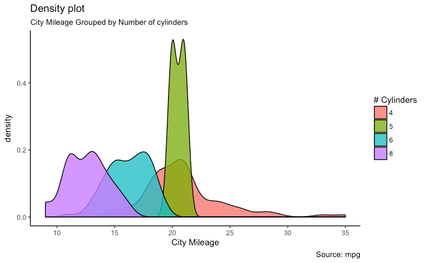
```

```{r echo=FALSE, out.width="50%"}
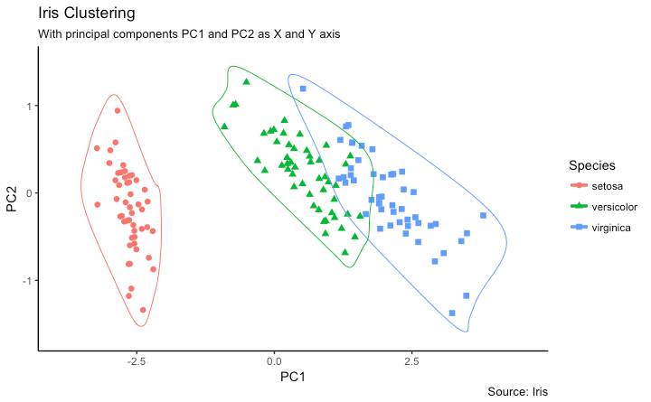
```

[Fonte: r-statistics.co](http://r-statistics.co/Top50-Ggplot2-Visualizations-MasterList-R-Code.html)

---

### RMarkdown

No R é possível criar documentos que podem, por exemplo, explicar os dados em textos e também apresentar os códigos e os resultados destes. Tudo em um só lugar.

**RMarkdown** é um documento que contém textos e códigos em R. 

O trecho de código do RMarkdown é chamado de **chunk**.

Atalho para criar um chunck: CTRL + ALT + I
---

### Para aprender mais

- [Livro R for Data Science](https://r4ds.had.co.nz) <br></br>
- [Material do Curso-R](https://www.curso-r.com/material/) <br></br>
- [Site do Tidyverse](- https://www.tidyverse.org) <br></br>
- [R-Bloggers](https://www.r-bloggers.com) <br></br>

---

### Referências

- https://r4ds.had.co.nz

- https://www.curso-r.com/material/

- https://www.tidyverse.org

- http://brunaw.com/slides/rladies-sp/13-08-2018/meetup.html#1

- https://bookdown.org/wevsena/curso_r_tce/curso_r_tce.html

- https://rstudio-pubs-static.s3.amazonaws.com/279878_c7634fb5fe9e40b7abc7c35aa724a2a0.html

- https://analisereal.com/tag/introducao-a-analise-de-dados-com-o-r-2/

- http://r-statistics.co/Top50-Ggplot2-Visualizations-MasterList-R-Code.html

A apresentação foi feita em [xaringan](https://github.com/yihui/xaringan), um pacote do R! :)

---

class: middle
<center></center>

---

class: middle

### Muito obrigada!

R-Ladies São Paulo
